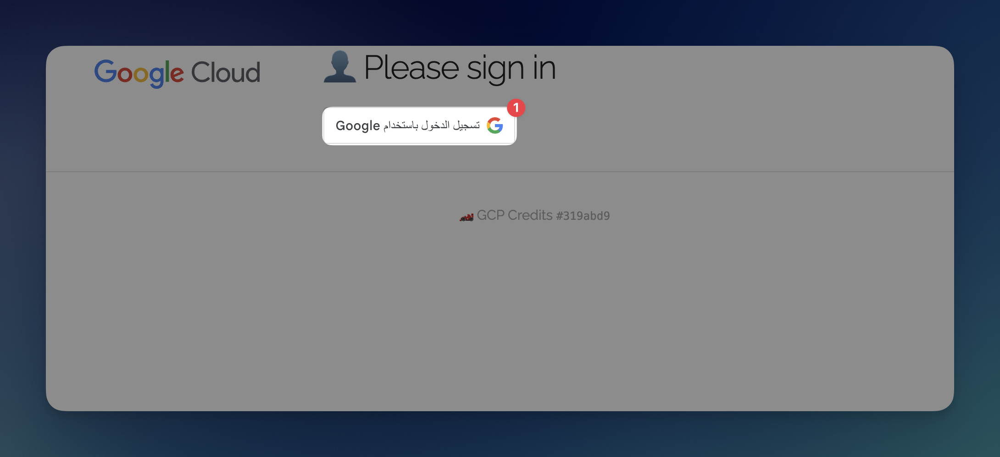
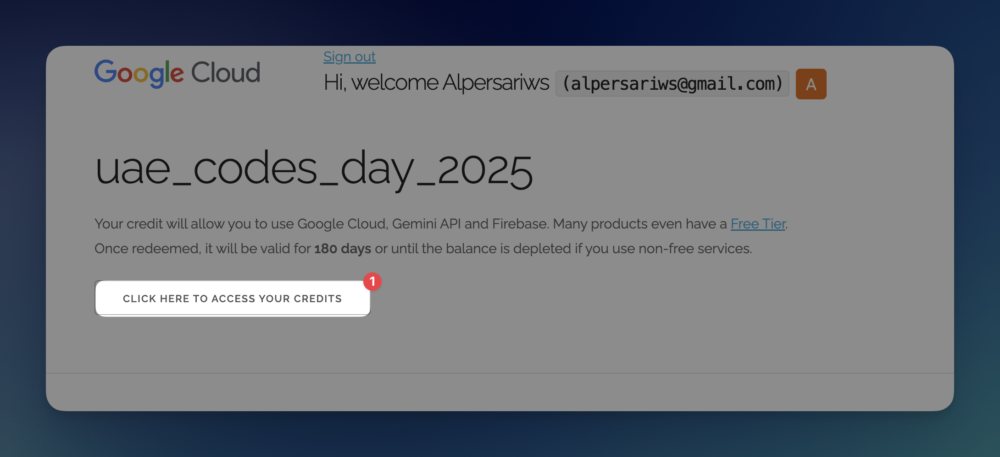
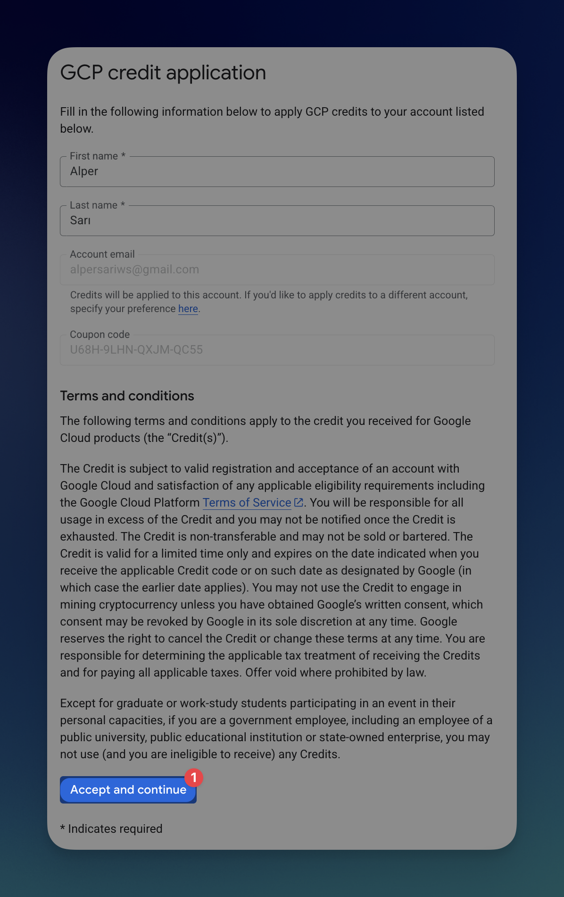
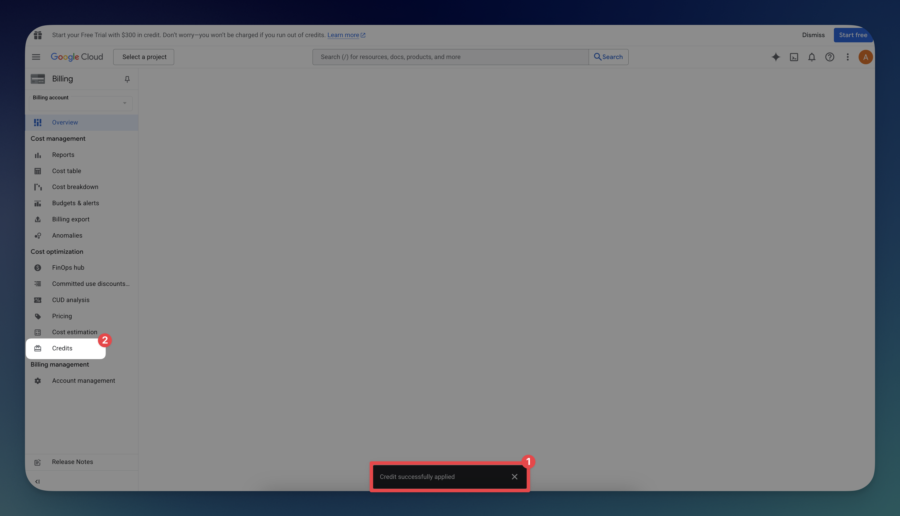
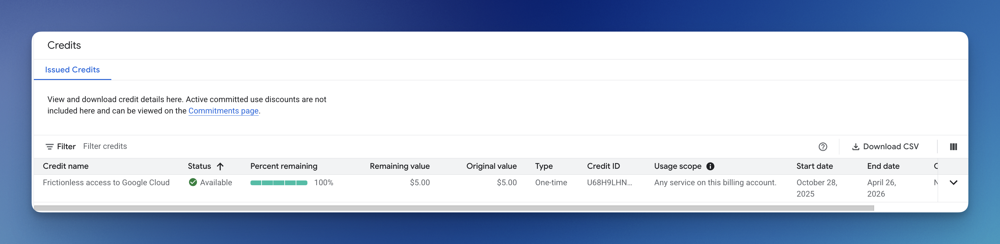
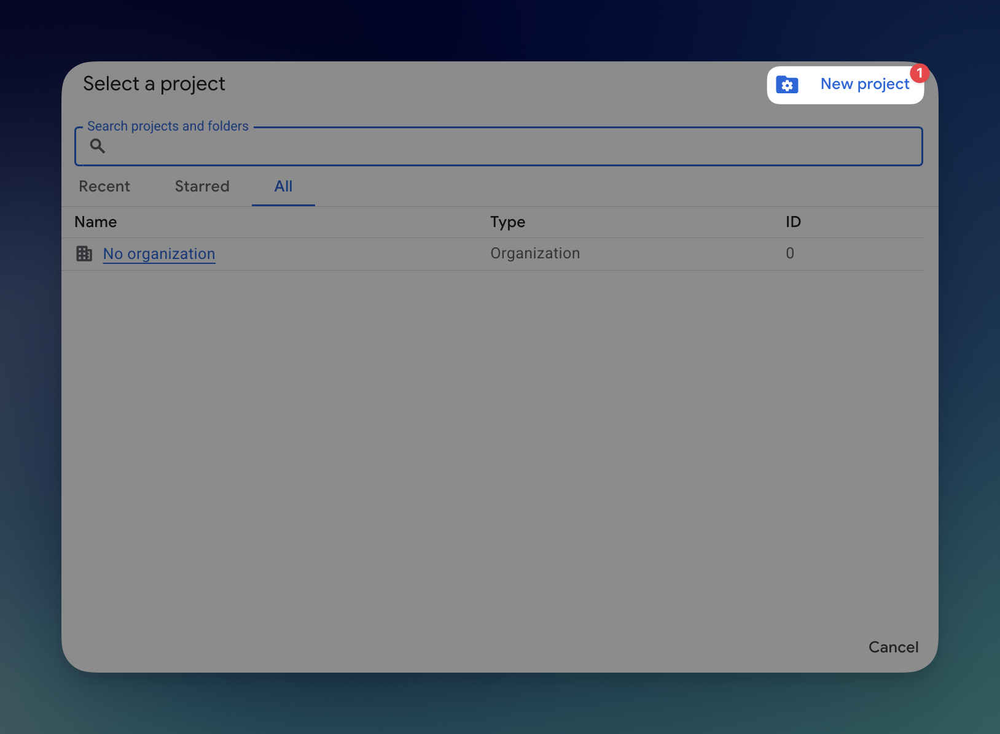
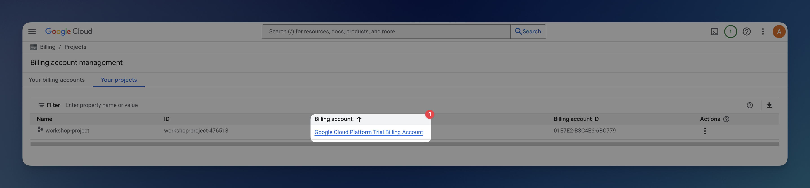

# Claiming GCP Credit for Workshop

This guide explains step-by-step how to easily claim your Google Cloud credits.

---

### 1. Visit the Credit Claim Page
Go to the provided URL. Click **“Sign in with Google”** — this will open the Google login page.

---

### 2. Claim Your Credits
After signing in, click the button to claim your GCP credits.

---

### 3. Accept Terms of Service
If this is your first time using Google Cloud, you’ll be asked to accept the Terms of Service.

---

### 4. Fill Out Basic Information
Enter your **first name** and **last name**, then click **Accept and Continue** to complete the process.

---

### 5. Verify Your Credits
You can check your available credits by visiting the **Credits** page.

✅ That’s it — you’ve successfully claimed your GCP credits!

---

### 6. Create a New Project
Next, create a new project to associate your billing account.

Enter a **project name**, click **Create**, and your Google Cloud project will be ready.

---

### 7. Verify Billing Account Link
To confirm your billing account is linked, navigate to  
**Billing → Manage Billing Accounts → Projects**.  

If you see **Google Cloud Platform Trial Billing Account**, everything is set up correctly!

If you are unable to access your Google Cloud account due to MFA enforcement, follow [this guide ](./define-mfa.md) to regain access.

---

